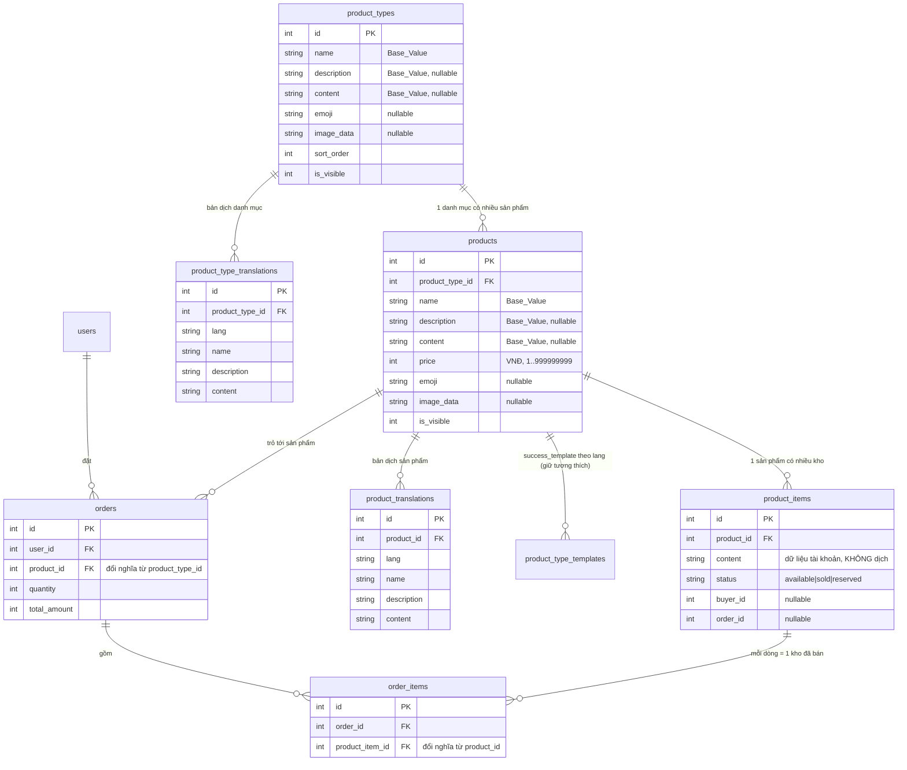
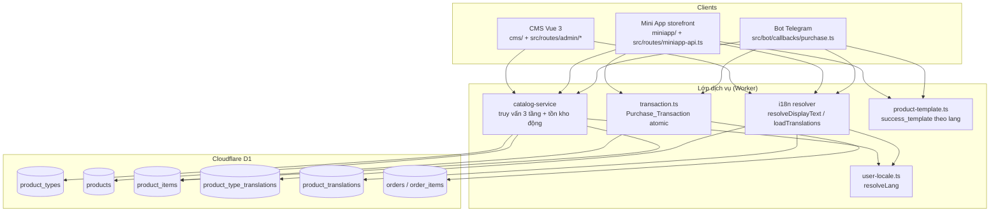
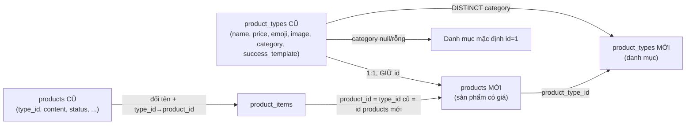

# Design Document — Product Catalog i18n Upgrade

## Overview

Tài liệu này thiết kế việc nâng cấp phần sản phẩm của Telegram Shop Bot từ mô hình hai tầng (`product_types` kiêm danh-mục-có-giá + `products` là kho tài khoản) sang **mô hình ba tầng** có **đa ngôn ngữ** và **fallback theo từng trường**:

1. **Product_Type (Danh mục)** — bảng `product_types`, KHÔNG có giá.
2. **Product (Sản phẩm có giá)** — bảng mới `products`, FK tới `product_types`.
3. **Product_Item (Kho tài khoản)** — bảng `product_items`, đổi tên từ `products` cũ, FK tới `products`.

Nguyên tắc chủ đạo:

- **Tái dùng nền tảng i18n hiện có**: registry `SUPPORTED_LANGUAGES` + `BASE_FALLBACK_LANG` trong `src/i18n/locales.ts`, chuỗi fallback `user.language → default_language → BASE_FALLBACK_LANG` (đã có trong `resolveLang`), và pattern bảng con khoá `(entity_id, lang)` giống `product_type_templates` (migration 0008).
- **Migrate không mất dữ liệu, không sửa migration cũ**: chỉ thêm file mới bắt đầu từ `0015`. Bảo toàn `orders`, `order_items`, `product_type_templates`.
- **Giữ tính atomic giao dịch mua** và ràng buộc **số dư không âm** (CHECK ở DB + concurrency guard).
- **Tiền là INTEGER VNĐ** (không thập phân).
- **Không tự thêm emoji** — emoji chỉ là dữ liệu admin nhập (cột `emoji`).

Các Requirement tham chiếu xuyên suốt: R1 (mô hình 3 tầng), R2 (migration), R3 (đa ngôn ngữ), R4 (fallback), R5 (types), R6 (bot), R7 (Mini App), R8 (CMS), R9 (orders), R10 (atomic + số dư), R11 (tương thích ngược).

### Quyết định thiết kế then chốt (tóm tắt)

| # | Quyết định | Lý do | Requirement |
|---|-----------|-------|-------------|
| D1 | Giữ tên bảng `product_types` cho danh mục; tạo bảng MỚI `products` cho sản phẩm có giá; đổi tên kho cũ `products` → `product_items` | Ít xung đột tên + tái dùng tên đã quen trong code/CMS | R1, R2 |
| D2 | Bảng dịch **theo thực thể** (`product_type_translations`, `product_translations`) với cột `(lang, name, description, content)` + `UNIQUE(entity_id, lang)` | Khớp pattern `product_type_templates` đã có; query đơn giản; thêm ngôn ngữ không đổi schema | R3, R11.5 |
| D3 | Base_Value lưu trực tiếp trên bản ghi gốc (cột `name`/`description`/`content` của `product_types` và `products`) | Đảm bảo luôn có giá trị hiển thị ngay sau migration mà chưa cần bản dịch | R3, R4, R11.4 |
| D4 | Giữ id của `product_types` cũ thành id của `products` mới (ánh xạ 1:1) | `orders.product_type_id` và `product_items.product_id` (đều = id cũ) tự khớp, không phải viết lại tham chiếu | R2.2, R2.4, R2.7, R9.6 |
| D5 | Đổi nghĩa cột: `orders.product_type_id → product_id` (FK `products`), `order_items.product_id → product_item_id` (FK `product_items`) | Phản ánh đúng mô hình mới, giữ giá trị id lịch sử | R9.1, R9.2 |
| D6 | Hàm thuần `resolveDisplayText` dùng chung cho bot/miniapp/CMS | Một nguồn logic fallback duy nhất, dễ test PBT | R4, R6, R7 |

---

## Architecture

### Sơ đồ quan hệ thực thể (ERD sau migration)



### Phân lớp xử lý



---

## Data Models

### Bảng `product_types` (Danh mục — KHÔNG giá)

| Cột | Kiểu | Null | Ghi chú |
|-----|------|------|---------|
| id | INTEGER PK | không | |
| name | TEXT | không | Base_Value tên danh mục (khác rỗng sau trim — R1.11) |
| description | TEXT | có | Base_Value mô tả |
| content | TEXT | có | Base_Value nội dung hiển thị (KHÁC content của Product_Item) |
| emoji | TEXT | có | dữ liệu admin nhập; null/rỗng = không có emoji |
| image_data | TEXT | có | data URL/HTTPS, fallback emoji ở Mini App |
| sort_order | INTEGER | không | |
| is_visible | INTEGER | không | 0/1 |
| created_at, updated_at | TEXT | không | ISO 8601 |

Không có cột `price` (R1.1).

### Bảng `products` (Sản phẩm có giá)

| Cột | Kiểu | Null | Ghi chú |
|-----|------|------|---------|
| id | INTEGER PK | không | giữ nguyên id từ `product_types` cũ (D4) |
| product_type_id | INTEGER FK→product_types(id) | không | danh mục cha (R1.2) |
| name | TEXT | không | Base_Value (R1.11) |
| description | TEXT | có | Base_Value |
| content | TEXT | có | Base_Value nội dung hiển thị |
| price | INTEGER | không | `CHECK(price >= 1 AND price <= 999999999)` (R1.5) |
| emoji | TEXT | có | giữ nguyên dữ liệu cũ; null/rỗng = không có emoji |
| image_data | TEXT | có | |
| sort_order | INTEGER | không | |
| is_visible | INTEGER | không | 0/1 |
| created_at, updated_at | TEXT | không | |

Giá + mô tả + ảnh nằm ở tầng này (R1.3).

### Bảng `product_items` (Kho tài khoản — đổi tên từ `products` cũ)

| Cột | Kiểu | Null | Ghi chú |
|-----|------|------|---------|
| id | INTEGER PK | không | giữ nguyên id cũ |
| product_id | INTEGER FK→products(id) | không | đổi tên từ `type_id` (R1.4) |
| content | TEXT | không | dữ liệu tài khoản — **KHÔNG dịch** |
| status | TEXT | không | `CHECK IN ('available','sold','reserved')` |
| buyer_id | INTEGER FK→users(id) | có | |
| order_id | INTEGER FK→orders(id) | có | |
| created_at | TEXT | không | |
| sold_at | TEXT | có | |

### Bảng `product_type_translations` và `product_translations` (Translation_Store — D2)

Hai bảng cùng hình dạng, theo pattern `product_type_templates`:

```sql
CREATE TABLE product_type_translations (
  id INTEGER PRIMARY KEY AUTOINCREMENT,
  product_type_id INTEGER NOT NULL REFERENCES product_types(id) ON DELETE CASCADE,
  lang TEXT NOT NULL,
  name TEXT,
  description TEXT,
  content TEXT,
  updated_at TEXT NOT NULL DEFAULT (datetime('now')),
  UNIQUE(product_type_id, lang)   -- R3.4
);

CREATE TABLE product_translations (
  id INTEGER PRIMARY KEY AUTOINCREMENT,
  product_id INTEGER NOT NULL REFERENCES products(id) ON DELETE CASCADE,
  lang TEXT NOT NULL,
  name TEXT,
  description TEXT,
  content TEXT,
  updated_at TEXT NOT NULL DEFAULT (datetime('now')),
  UNIQUE(product_id, lang)        -- R3.4
);
```

**Vì sao chọn phương án này (D2) thay vì EAV chung hay JSON:**

- **EAV chung `(entity_type, entity_id, lang, field, value)`**: linh hoạt nhất nhưng query cồng kềnh (mỗi trường 1 dòng → phải pivot 3 dòng/ngôn ngữ), khó ràng buộc độ dài từng trường, và không khớp pattern hiện có. Loại.
- **Cột JSON `{lang: {name, description, content}}`**: gọn nhưng khó index, khó validate độ dài/UNIQUE ở tầng DB, và lệch hẳn với `product_type_templates`. Loại.
- **Bảng theo thực thể (chọn)**: mỗi `(entity, lang)` một dòng chứa cả ba trường; `UNIQUE(entity_id, lang)` đảm bảo R3.4; thêm ngôn ngữ chỉ là thêm dòng (không đổi schema — R3.3, R11.5); query một phát lấy đủ bản dịch một ngôn ngữ. Nhất quán với `product_type_templates` (cùng khoá `(entity, lang)`).

`lang` để mở (không CHECK cứng) — lọc theo `SUPPORTED_LANGUAGES` ở tầng ứng dụng (R3.5), giống `product-template.ts`. Giới hạn độ dài (name ≤ 200, description ≤ 2000, content ≤ 5000) enforce ở tầng ứng dụng/CMS (R3.1, R3.2, R8.9); DB không CHECK độ dài để tránh phải sửa schema khi đổi chính sách.

### Index

```sql
-- Tồn kho động: COUNT(product_items available theo product_id) (R1.7)
CREATE INDEX idx_product_items_product_status ON product_items(product_id, status);
-- Liệt kê sản phẩm theo danh mục + trạng thái hiển thị (R6.2, R7.2)
CREATE INDEX idx_products_type_visible ON products(product_type_id, is_visible);
-- Chống trùng content trong cùng sản phẩm (kế thừa unique cũ, đổi sang product_id)
CREATE UNIQUE INDEX idx_product_items_content ON product_items(product_id, content);
-- Tra cứu bản dịch
CREATE INDEX idx_pt_trans ON product_type_translations(product_type_id, lang);
CREATE INDEX idx_prod_trans ON product_translations(product_id, lang);
```

---

## Migration Plan (0015)

D1/SQLite không hỗ trợ nhiều biến đổi ALTER phức tạp, nên dùng chiến lược **tạo bảng mới + copy dữ liệu + đổi tên**, theo đúng pattern đã chứng minh ở `0008_multi_region_payments.sql` (rebuild + `PRAGMA foreign_keys=OFF`). Toàn bộ nằm trong **một file `0015_product_three_tier_i18n.sql`** (R2.1).

### Ánh xạ dữ liệu (id-preserving — D4)



Vì id của `products` mới = id của `product_types` cũ:
- `orders.product_type_id` (= id `product_types` cũ) **tự khớp** thành `product_id` mới → chỉ cần đổi tên/đổi FK, không phải tính lại giá trị (R2.7).
- `product_items.product_id` (= `type_id` cũ = id `product_types` cũ) **tự khớp** `products.id` mới (R2.4).

### Thứ tự các bước SQL (an toàn)

```sql
PRAGMA foreign_keys=OFF;

-- BƯỚC 0: Chụp số đếm trước migration để đối soát cuối (R2.8, R2.10)
CREATE TEMP TABLE _pre AS
  SELECT
    (SELECT COUNT(*) FROM products)       AS n_items,   -- products CŨ = kho
    (SELECT COUNT(*) FROM product_types)  AS n_products,-- product_types CŨ = sản phẩm mới
    (SELECT COUNT(*) FROM orders)         AS n_orders,
    (SELECT COUNT(*) FROM product_type_templates) AS n_tpl;

-- BƯỚC 1: Kho tài khoản: products (CŨ) -> product_items_old, type_id -> product_id
--   Bảng final product_items sẽ được rebuild sau khi tạo products mới để FK product_id trỏ đúng products(id).
ALTER TABLE products RENAME TO product_items_old;
ALTER TABLE product_items_old RENAME COLUMN type_id TO product_id;

-- BƯỚC 2: Tách bảng giá cũ làm nguồn sinh sản phẩm + danh mục
ALTER TABLE product_types RENAME TO product_types_old;

-- BƯỚC 3: product_types MỚI = danh mục (không giá)
CREATE TABLE product_types ( /* ... như mục Data Model ... */ );

-- 3a. Danh mục mặc định cố định, duy nhất (id=1) CHỈ tạo khi có category null/rỗng (R2.6, R2.12)
INSERT INTO product_types (id, name, sort_order, is_visible)
SELECT 1, 'Chưa phân loại', 0, 1
WHERE EXISTS (
  SELECT 1 FROM product_types_old
  WHERE category IS NULL OR TRIM(category) = ''
);

-- 3b. Bảng map tạm cho category hợp lệ (R2.5, R2.13)
CREATE TEMP TABLE _category_map (
  category_key TEXT PRIMARY KEY,
  product_type_id INTEGER NOT NULL UNIQUE
);
INSERT INTO _category_map (category_key, product_type_id)
SELECT
  category_key,
  (SELECT COUNT(*) FROM product_types) + ROW_NUMBER() OVER (ORDER BY category_key)
FROM (
  SELECT DISTINCT TRIM(category) AS category_key
  FROM product_types_old
  WHERE category IS NOT NULL AND TRIM(category) <> ''
);

-- 3c. Mỗi category DISTINCT (khác null/rỗng) -> 1 danh mục (R2.5)
INSERT INTO product_types (id, name, sort_order, is_visible)
SELECT product_type_id, category_key, 0, 1
FROM _category_map
ORDER BY product_type_id;

-- BƯỚC 4: products MỚI = sản phẩm có giá, GIỮ NGUYÊN id cũ (R2.2, D4)
CREATE TABLE products ( /* ... như mục Data Model ... */ );
INSERT INTO products
  (id, product_type_id, name, description, content, price, emoji, image_data, sort_order, is_visible, created_at, updated_at)
SELECT
  o.id,
  CASE
    WHEN o.category IS NULL OR TRIM(o.category) = '' THEN 1
    ELSE (SELECT m.product_type_id FROM _category_map m WHERE m.category_key = TRIM(o.category))
  END,
  o.name, o.description, NULL, o.price, o.emoji, o.image_data, o.sort_order, o.is_visible,
  o.created_at, o.updated_at
FROM product_types_old o;               -- giá/mô tả/ảnh/emoji giữ nguyên (R2.2)

-- 4b. product_items FINAL = kho cũ, FK product_id -> products(id) (R1.4, R2.3, R2.4)
CREATE TABLE product_items (
  id INTEGER PRIMARY KEY AUTOINCREMENT,
  product_id INTEGER NOT NULL REFERENCES products(id),
  content TEXT NOT NULL,
  status TEXT NOT NULL DEFAULT 'available' CHECK(status IN ('available','sold','reserved')),
  buyer_id INTEGER REFERENCES users(id),
  order_id INTEGER REFERENCES orders(id),
  created_at TEXT NOT NULL DEFAULT (datetime('now')),
  sold_at TEXT
);
INSERT INTO product_items (id, product_id, content, status, buyer_id, order_id, created_at, sold_at)
SELECT id, product_id, content, status, buyer_id, order_id, created_at, sold_at
FROM product_items_old;

-- BƯỚC 5: product_type_templates — GIỮ NGUYÊN bản ghi, chỉ retarget FK -> products (R11.1)
--   product_type_id của template = id product_types cũ = id products mới ⇒ tự khớp.
--   Rebuild copy 1:1 (cùng số dòng, cùng nội dung từng cột) để đổi đích FK an toàn.
CREATE TABLE product_type_templates_new (
  id INTEGER PRIMARY KEY AUTOINCREMENT,
  product_type_id INTEGER NOT NULL REFERENCES products(id) ON DELETE CASCADE, -- giữ TÊN cột (tương thích code)
  lang TEXT NOT NULL,
  success_template TEXT,
  updated_at TEXT NOT NULL DEFAULT (datetime('now')),
  UNIQUE(product_type_id, lang)
);
INSERT INTO product_type_templates_new (id, product_type_id, lang, success_template, updated_at)
SELECT id, product_type_id, lang, success_template, updated_at FROM product_type_templates;
DROP TABLE product_type_templates;
ALTER TABLE product_type_templates_new RENAME TO product_type_templates;
CREATE INDEX idx_ptt_type_lang ON product_type_templates(product_type_id, lang);

-- BƯỚC 6: orders — đổi product_type_id -> product_id (FK products), giữ giá trị id (R2.7, R9.1, R9.6)
CREATE TABLE orders_new (
  id INTEGER PRIMARY KEY AUTOINCREMENT,
  user_id INTEGER NOT NULL REFERENCES users(id),
  product_id INTEGER NOT NULL REFERENCES products(id),
  quantity INTEGER NOT NULL CHECK(quantity > 0),
  total_amount INTEGER NOT NULL,
  transaction_id INTEGER,
  status TEXT NOT NULL DEFAULT 'completed' CHECK(status IN ('completed','refunded')),
  created_at TEXT NOT NULL DEFAULT (datetime('now'))
);
INSERT INTO orders_new (id, user_id, product_id, quantity, total_amount, transaction_id, status, created_at)
SELECT id, user_id, product_type_id, quantity, total_amount, transaction_id, status, created_at FROM orders;
DROP TABLE orders; ALTER TABLE orders_new RENAME TO orders;
CREATE INDEX idx_orders_user_created ON orders(user_id, created_at DESC);

-- BƯỚC 7: order_items — đổi product_id -> product_item_id (FK product_items), giữ giá trị id (R2.7, R9.2)
CREATE TABLE order_items_new (
  id INTEGER PRIMARY KEY AUTOINCREMENT,
  order_id INTEGER NOT NULL REFERENCES orders(id),
  product_item_id INTEGER NOT NULL REFERENCES product_items(id),
  created_at TEXT NOT NULL DEFAULT (datetime('now'))
);
INSERT INTO order_items_new (id, order_id, product_item_id, created_at)
SELECT id, order_id, product_id, created_at FROM order_items;
DROP TABLE order_items; ALTER TABLE order_items_new RENAME TO order_items;
CREATE INDEX idx_order_items_order ON order_items(order_id);

-- BƯỚC 8: Translation_Store
CREATE TABLE product_type_translations ( /* ... */ );
CREATE TABLE product_translations ( /* ... */ );
CREATE INDEX idx_pt_trans ON product_type_translations(product_type_id, lang);
CREATE INDEX idx_prod_trans ON product_translations(product_id, lang);

-- BƯỚC 9: Index kho/sản phẩm
--   Index cũ của products CŨ nằm trên product_items_old và biến mất khi drop bảng old.
CREATE INDEX idx_product_items_product_status ON product_items(product_id, status);
CREATE INDEX idx_products_type_visible ON products(product_type_id, is_visible);
CREATE UNIQUE INDEX idx_product_items_content ON product_items(product_id, content);

-- BƯỚC 10: Đối soát số lượng + FK mới — ÉP LỖI để rollback toàn migration nếu sai (R2.8, R2.10)
--   SQLite/D1 không ném lỗi với 1/0, nên dùng CHECK(ok = 1).
CREATE TEMP TABLE _assert (ok INTEGER NOT NULL CHECK(ok = 1));
INSERT INTO _assert (ok) VALUES (
  CASE WHEN (SELECT COUNT(*) FROM product_items) = (SELECT n_items FROM _pre)
            AND (SELECT COUNT(*) FROM products) = (SELECT n_products FROM _pre)
            AND (SELECT COUNT(*) FROM orders) = (SELECT n_orders FROM _pre)
            AND (SELECT COUNT(*) FROM product_type_templates) = (SELECT n_tpl FROM _pre)
            AND NOT EXISTS (
              SELECT 1 FROM products p
              LEFT JOIN product_types pt ON pt.id = p.product_type_id
              WHERE pt.id IS NULL
            )
            AND NOT EXISTS (
              SELECT 1 FROM product_items pi
              LEFT JOIN products p ON p.id = pi.product_id
              WHERE p.id IS NULL
            )
            AND NOT EXISTS (
              SELECT 1 FROM orders o
              LEFT JOIN products p ON p.id = o.product_id
              WHERE p.id IS NULL
            )
            AND NOT EXISTS (
              SELECT 1 FROM order_items oi
              LEFT JOIN orders o ON o.id = oi.order_id
              LEFT JOIN product_items pi ON pi.id = oi.product_item_id
              WHERE o.id IS NULL OR pi.id IS NULL
            )
            AND NOT EXISTS (
              SELECT 1 FROM product_type_templates t
              LEFT JOIN products p ON p.id = t.product_type_id
              WHERE p.id IS NULL
            )
       THEN 1 ELSE 0 END
);

-- BƯỚC 11: Dọn dẹp
DROP TABLE product_items_old;
DROP TABLE product_types_old;
PRAGMA foreign_keys=ON;
```

### Tính atomic & rollback của migration (R2.9, R2.10, R11.6)

- `wrangler d1 migrations apply` áp dụng từng file; nếu một câu lệnh lỗi, file migration được coi là **chưa áp dụng** và không đánh dấu trong bảng theo dõi (`d1_migrations`). Bước 10 cố tình vi phạm `CHECK(ok = 1)` khi số đếm hoặc FK mới sai → toàn bộ file dừng và không commit (đáp ứng "rollback khi sai lệch số lượng/ánh xạ").
- **Lưới an toàn vận hành**: trước `db:migrate:remote`, runbook (xem Testing Strategy) **export DB** (`wrangler d1 export`) để khôi phục thủ công nếu môi trường không rollback trọn vẹn — củng cố R2.9/R11.6.
- Bằng chứng đã chạy: file `0015_*` được ghi vào bảng theo dõi migration của D1 khi thành công (R2.11).

### Tương thích vận hành khi migrate (R11.2, R11.3)

- Migration là DDL + copy trên D1, thực thi nhanh; deploy theo thứ tự: **(1)** áp migration, **(2)** deploy Worker mới đọc schema 3 tầng. Vì id được bảo toàn và lớp `catalog-service` trừu tượng hoá truy vấn, flow duyệt/mua phục vụ ngay sau khi hoàn tất mà không cần thao tác thủ công (R11.2).
- Sau migration, mọi `products`/`product_types` đều có Base_Value (tên cũ) khác rỗng nên hiển thị được ngay dù chưa có bản dịch (R11.4); trường hợp tên gốc rỗng dùng placeholder sinh ra (R11.7).
- Lưu ý trung thực: migration 0015 là đổi schema bằng DDL rename/rebuild, không phải thiết kế hai schema chạy song song. Mục tiêu kiểm chứng được là file migration không được đánh dấu applied cho tới khi copy + assert hoàn tất, không để schema nửa vời trở thành trạng thái hợp lệ, và sau commit Worker mới phục vụ ngay bằng schema 3 tầng.

---

## i18n Resolution Design

### Cấu trúc dữ liệu bản dịch nạp về

```ts
interface EntityTranslations {
  // map lang -> giá trị từng trường (đã lọc theo SUPPORTED_LANGUAGES)
  byLang: Map<Lang, { name: string | null; description: string | null; content: string | null }>
}
```

### Hàm thuần `resolveDisplayText` (D6 — dùng chung bot/miniapp/CMS)

Áp dụng **độc lập cho từng trường** (name/description/content) chuỗi fallback:
`Display_Language → Default_Language → Base_Fallback_Language → Base_Value → placeholder` (R4.5).

```ts
// Một trường được coi là HỢP LỆ ⇔ khác null và khác rỗng sau trim (R4.1)
function isValidText(v: string | null | undefined): v is string {
  return typeof v === 'string' && v.trim().length > 0
}

type Field = 'name' | 'description' | 'content'

/**
 * Trả về chuỗi hiển thị KHÁC RỖNG cho một trường.
 * @param translations  bản dịch đã lọc theo SUPPORTED_LANGUAGES (R3.5)
 * @param baseValue     Base_Value của trường (cột gốc trên bản ghi thực thể)
 * @param displayLang   Display_Language (đã qua resolveLang)
 * @param defaultLang   Default_Language (đọc từ system_config)
 * @param placeholder   giá trị placeholder khác rỗng (R4.6, R11.7)
 */
function resolveDisplayText(
  translations: EntityTranslations,
  field: Field,
  baseValue: string | null,
  displayLang: Lang,
  defaultLang: Lang,
  placeholder: string
): string {
  const chain: (Lang | null)[] = [displayLang, defaultLang, BASE_FALLBACK_LANG]
  for (const lang of chain) {
    if (!lang) continue
    const v = translations.byLang.get(lang)?.[field]
    if (isValidText(v)) return v.trim()
  }
  if (isValidText(baseValue)) return baseValue.trim()   // R4.6
  return placeholder                                     // R4.6, R11.7 (luôn khác rỗng)
}
```

Đặc tính quan trọng:
- `displayLang`/`defaultLang` luôn là `Lang` hợp lệ (do `resolveLang` đảm bảo) → yêu cầu hiển thị theo mã ngoài `SUPPORTED_LANGUAGES` không bị từ chối mà rơi về Default_Language (R3.6).
- Bản dịch có `lang` ngoài registry đã bị loại ở bước nạp (`loadTranslations`) nên không bao giờ lọt vào `byLang` (R3.5).
- Kết quả **luôn khác chuỗi rỗng** khi `placeholder` khác rỗng (R4.6, R11.7).

### Nạp + lọc bản dịch (`loadTranslations`)

```ts
async function loadProductTranslations(db: D1Database, productId: number): Promise<EntityTranslations> {
  const { results } = await db
    .prepare('SELECT lang, name, description, content FROM product_translations WHERE product_id = ?')
    .bind(productId).all<{ lang: string; name: string|null; description: string|null; content: string|null }>()
  const byLang = new Map()
  for (const r of results ?? []) {
    if (isSupportedLang(r.lang)) byLang.set(r.lang, { name: r.name, description: r.description, content: r.content }) // R3.5
  }
  return { byLang }
}
```

`default_language` đọc runtime từ `system_config` (đã có `readSystemConfigValue`); validate theo registry, sai → `BASE_FALLBACK_LANG` (fail-safe, đồng nhất với `resolveLang`).

---

## Components and Interfaces

### Lớp dịch vụ mới: `src/services/catalog-service.ts`

Trừu tượng hoá truy vấn 3 tầng + tồn kho động (R1.7):

```ts
// Tồn kho động = COUNT product_items.available theo product_id (R1.7)
async function getProductStock(db, productId): Promise<number>
// Danh mục đang hiển thị (R6.1, R7.1)
async function listVisibleCategories(db): Promise<DbProductType[]>
// Sản phẩm hiển thị thuộc danh mục (R6.2, R7.2)
async function listVisibleProducts(db, productTypeId): Promise<DbProduct[]>
// Sản phẩm + tồn kho (LEFT JOIN COUNT) để hiển thị "hết hàng" mà vẫn liệt kê
async function listProductsWithStock(db, productTypeId): Promise<(DbProduct & { stock: number })[]>
```

### `src/services/i18n-catalog.ts` (resolver — mục i18n ở trên)

`resolveDisplayText`, `loadProductTranslations`, `loadProductTypeTranslations`, `loadDisplayLang`.

### Bot (`src/bot/callbacks/purchase.ts`) — R6

Luồng mới **duyệt 2 cấp**: danh mục → sản phẩm → chọn số lượng → mua.

- `handleCategoryList`: liệt kê `product_types` `is_visible=1` (R6.1). Tên qua `resolveDisplayText(name)`. Rỗng → thông báo "danh mục trống" (R6.7).
- `handleProductList(categoryId)`: liệt kê `products` `is_visible=1` thuộc danh mục, kèm giá (`formatMoneyFor`) + tồn kho động (R6.2). Không có sản phẩm hiển thị → danh sách trống + thông báo tuỳ chọn (R6.8).
- `handleQuantitySelect` / `handlePurchaseConfirm`: gọi `executePurchase` với `productId` (thay cho `categoryId` cũ). Số dư < giá → "số dư không đủ", không trừ tiền (R6.4). Hết `available` → "hết hàng" (R6.5). Thành công → `renderSuccessMessage` theo Display_Language, thiếu thì Default_Language (R6.6) — tái dùng `loadProductTypeTemplates` (giờ keyed theo product_id).

### Mini App — R7

`src/routes/miniapp-api.ts`:
- `GET /api/app/categories` → `product_types` hiển thị (bộ lọc danh mục) (R7.1). Text qua resolver theo `resolveLang(user)`.
- `GET /api/app/categories/:id/products` → `products` hiển thị thuộc danh mục, kèm `stock`/`in_stock`; danh mục rỗng → mảng rỗng (R7.2, R7.3).
- DTO trả `name`/`description`/`content` đã resolve theo ngôn ngữ user (R7.4, R7.5), `price` lấy từ tầng `products` (R7.8).
- Ảnh thay thế (`miniapp/`): ưu tiên `product.image_data` → `product.emoji` → `product_type.emoji` (R7.6, R7.7); emoji render lỗi thì bỏ qua, không vỡ giao diện (R7.9 — xử lý ở component Vue với `onerror`/try-catch).

### CMS — R8

`src/routes/admin/`:
- `product-types.ts`: CRUD danh mục (bỏ cột `price` khỏi validate); chặn xoá khi còn `products` con (R8.1, R8.7, R1.10).
- `products.ts` (viết lại): CRUD sản phẩm gắn `product_type_id`; **validate giá** `Number.isInteger && 1..999999999`, sai → từ chối toàn bộ thao tác lưu, không lưu phần nào khác (R1.6, R8.6); chặn xoá khi còn `product_items` con (R1.10).
- `product-items.ts` (mới, tách từ products cũ): thêm/xoá kho gắn `product_id` (R8.3); chặn tạo khi `product_id` không tồn tại (R1.9); chỉ xoá item `available`.
- `translations` endpoints: `GET/PUT /product-types/:id/translations` và `/products/:id/translations` — upsert `(entity, lang)`; validate `lang ∈ SUPPORTED_LANGUAGES` (R8.8), `name` 1..200, `description` ≤2000, `content` ≤5000 (R8.4, R8.5, R8.9); trùng `(entity,lang)` khi tạo mới → lỗi (R3.8); lang ngoài registry → từ chối (R3.7).
- UI Vue (`cms/src/views/`): tab 3 tầng + editor bản dịch theo từng `lang` (lấy danh sách lang từ API/registry).

### Giao dịch mua — `src/services/transaction.ts` (R9, R10)

Cập nhật để trỏ mô hình mới, **giữ nguyên cấu trúc atomic 4 phase** hiện có:

```ts
async executePurchase(db, userId, productId, quantity, unitPrice): Promise<PurchaseResult>
```

- Phase 1: tạo `orders` với `product_id` (đổi từ `product_type_id`), lấy `orderId`.
- Phase 2: GIÀNH kho nguyên tử: `UPDATE product_items SET status='sold',... WHERE status='available' AND id IN (...)`; số dòng đổi < quantity → hoàn nguyên + báo hết hàng (R9.3, R9.5, R10.1, R10.2).
- Phase 3: trừ số dư có guard `WHERE balance >= total` (chống âm — R10.3) và `balance = balance - ?` (chống lost update). `total = 0` vẫn xử lý như cũ; **bổ sung guard `total <= 0` → từ chối** trước khi vào batch (R10.4, R10.6).
- Phase 4: ghi `order_items` với `product_item_id` (đổi tên cột) + `transactions` (R9.2).
- Mọi bước lỗi → compensating rollback về trạng thái trước (R9.7, R10.5).

Query nguồn hàng đổi từ `WHERE type_id = ?` sang `WHERE product_id = ?`.

### Cập nhật Types — `src/types/db.ts` (R5)

```ts
export interface DbProductType {          // Danh mục — KHÔNG price
  id: number
  name: string
  description: string | null
  content: string | null
  emoji: string | null
  image_data: string | null
  sort_order: number
  is_visible: number
  created_at: string
  updated_at: string
}

export interface DbProduct {              // Sản phẩm có giá
  id: number
  product_type_id: number                 // FK -> product_types (R5.3)
  name: string
  description: string | null
  content: string | null
  price: number
  emoji: string | null
  image_data: string | null
  sort_order: number
  is_visible: number
  created_at: string
  updated_at: string
}

export interface DbProductItem {          // Kho (đổi tên từ DbProduct cũ)
  id: number
  product_id: number                      // FK -> products (R5.3)
  content: string
  status: 'available' | 'sold' | 'reserved'
  buyer_id: number | null
  order_id: number | null
  created_at: string
  sold_at: string | null
}

export interface DbProductTranslation {   // R5.2
  id: number
  product_id: number
  lang: string
  name: string | null
  description: string | null
  content: string | null
  updated_at: string
}

export interface DbProductTypeTranslation {
  id: number
  product_type_id: number
  lang: string
  name: string | null
  description: string | null
  content: string | null
  updated_at: string
}

export interface DbOrder {                // product_type_id -> product_id
  id: number
  user_id: number
  product_id: number
  quantity: number
  total_amount: number
  transaction_id: number | null
  status: 'completed' | 'refunded'
  created_at: string
}

export interface DbOrderItem {            // product_id -> product_item_id
  id: number
  order_id: number
  product_item_id: number
  created_at: string
}

// GIỮ NGUYÊN: DbProductTypeTemplate (cột product_type_id giờ trỏ products.id — tương thích code)
```

Mỗi field null ⇔ cột cho phép NULL (R5.1, R5.4).

### Placeholder, định dạng tiền, escape HTML

- **Placeholder** (R4.6, R11.7): hằng `DISPLAY_PLACEHOLDER` khác rỗng (vd `"Sản phẩm #<id>"` sinh theo id) — luôn khác chuỗi rỗng. Dùng id thực thể để admin dễ truy vết.
- **Định dạng tiền**: tái dùng `formatMoneyFor`/`buildCurrencyContext` (đã có) — INTEGER VNĐ, hiển thị theo Region/lang.
- **Escape HTML**: text động hiển thị qua bot dùng `escapeHtml` (đã có trong `telegram-template.ts`); name/description sau resolve phải escape trước khi nhúng vào HTML message (R6) để không phá vỡ markup.

---
## Correctness Properties

*Một property (thuộc tính) là đặc tính/hành vi phải đúng với MỌI execution hợp lệ của hệ thống — một phát biểu hình thức về điều phần mềm phải làm. Property là cầu nối giữa đặc tả cho người đọc và đảm bảo đúng đắn kiểm chứng được bằng máy.*

Dự án dùng **vitest + fast-check**. Mỗi property test chạy tối thiểu 100 vòng và gắn tag:
`Feature: product-catalog-i18n-upgrade, Property {số}: {nội dung}`.

Sau phản tỉnh (property reflection), các tiêu chí trùng lặp đã được gộp: R1.6/R8.6 (giá) gộp; R3.6/R11.4/R11.5/R11.7 gộp vào property fallback; R6.3-6.5/R10.4/R10.6 gộp vào điều kiện mua; R9.3/R9.7/R10.5 gộp vào atomicity; R2.2-2.8/R9.6 gộp vào migration mapping.

### Property 1: Validate giá là all-or-nothing
*For any* bản ghi Product hiện có và *for any* giá trị giá đầu vào (số nguyên/thập phân, âm/dương, quanh biên 1 và 999.999.999), thao tác lưu được chấp nhận **khi và chỉ khi** giá là số nguyên và `1 <= giá <= 999.999.999`; nếu không hợp lệ thì KHÔNG trường nào của bản ghi thay đổi và trả lỗi giá, còn nếu hợp lệ thì lưu thành công và không trả lỗi giá.
**Validates: Requirements 1.5, 1.6, 8.6**

### Property 2: Tồn kho động bằng số Product_Item available
*For any* Product và *for any* tập Product_Item con với trạng thái ngẫu nhiên, tồn kho tính được bằng đúng số Product_Item ở trạng thái `available`, và Product được coi là hết hàng khi và chỉ khi tồn kho đó bằng 0.
**Validates: Requirements 1.7**

### Property 3: Tạo bản ghi con cần cha tồn tại
*For any* thao tác tạo Product (hoặc Product_Item) với tham chiếu cha ngẫu nhiên, thao tác thành công khi và chỉ khi cha tồn tại; khi cha không tồn tại, không có bản ghi con nào được tạo.
**Validates: Requirements 1.8, 1.9**

### Property 4: Chặn xoá cha còn con
*For any* cây danh mục/sản phẩm/kho sinh ngẫu nhiên, xoá một Product_Type còn ít nhất một Product con (hoặc một Product còn ít nhất một Product_Item con) bị chặn và toàn bộ bản ghi liên quan giữ nguyên; chỉ khi không còn con thì xoá mới thành công.
**Validates: Requirements 1.10, 8.7**

### Property 5: Migration bảo toàn số lượng và ánh xạ
*For any* trạng thái "DB cũ" sinh ngẫu nhiên (gồm các bản ghi `product_types` cũ với `category` ngẫu nhiên kể cả null/rỗng, các bản ghi `products` cũ, và `orders`), hàm ánh xạ migration phải thoả đồng thời: tổng số Product_Item bằng tổng số `products` cũ; tổng số Product bằng tổng số `product_types` cũ; tổng số `orders` không đổi; mỗi `category` phân biệt (khác null/rỗng sau trim) sinh đúng một danh mục; mọi bản ghi thiếu `category` dồn về đúng một danh mục mặc định chỉ khi có ít nhất một bản ghi thiếu `category`; dữ liệu không thiếu `category` không sinh danh mục mặc định giả; nếu một category hợp lệ trùng tên hiển thị của danh mục mặc định thì vẫn là danh mục riêng; mọi Product có `product_type_id` trỏ tới một danh mục tồn tại; và mọi tham chiếu `orders`/`order_items` vẫn trỏ tới đúng Product/Product_Item theo dữ liệu trước migration (id được bảo toàn).
**Validates: Requirements 2.2, 2.4, 2.5, 2.6, 2.7, 2.8, 2.10, 2.11, 2.12, 2.13, 9.6**

### Property 6: Migration bảo toàn nguyên vẹn product_type_templates
*For any* tập bản ghi `product_type_templates` trước migration, tập sau migration bằng đúng tập trước theo từng bản ghi (`id`, `product_type_id`, `lang`, `success_template`, `updated_at`) — không thêm, không xoá, không sửa.
**Validates: Requirements 11.1**

### Property 7: Tính duy nhất của (thực thể, ngôn ngữ)
*For any* chuỗi thao tác upsert bản dịch sinh ngẫu nhiên trên một tập thực thể, sau cùng mỗi tổ hợp `(thực thể, lang)` xuất hiện tối đa một lần; thao tác tạo mới cho `(thực thể, lang)` đã tồn tại bị từ chối và giữ nguyên bản dịch hiện có.
**Validates: Requirements 3.4, 3.8**

### Property 8: Đọc chỉ trả ngôn ngữ thuộc registry
*For any* tập bản dịch có lẫn mã ngôn ngữ trong và ngoài `SUPPORTED_LANGUAGES`, kết quả nạp bản dịch chỉ chứa các mã thuộc `SUPPORTED_LANGUAGES` và bỏ qua mọi mã ngoài registry.
**Validates: Requirements 3.5**

### Property 9: Ghi bản dịch từ chối ngôn ngữ ngoài registry
*For any* mã ngôn ngữ đầu vào, thao tác lưu bản dịch thành công khi và chỉ khi mã đó thuộc `SUPPORTED_LANGUAGES`; nếu không, dữ liệu hiện có giữ nguyên.
**Validates: Requirements 3.7, 8.8**

### Property 10: Validate độ dài trường dịch
*For any* bộ giá trị `(name, description, content)` với độ dài ngẫu nhiên quanh các biên, thao tác lưu bản dịch được chấp nhận khi và chỉ khi `1 <= len(name) <= 200`, `len(description) <= 2000` và `len(content) <= 5000` (và mã ngôn ngữ hợp lệ); ngược lại bị từ chối.
**Validates: Requirements 8.4, 8.5, 8.9**

### Property 11: Fallback hiển thị theo từng trường luôn cho chuỗi khác rỗng
*For any* tập bản dịch (gồm các trường hợp thiếu, null, hoặc toàn khoảng trắng), *for any* Base_Value, và *for any* Display_Language/Default_Language, với mỗi trường văn bản (name, description, content) một cách độc lập: kết quả `resolveDisplayText` bằng giá trị **hợp lệ đầu tiên** theo chuỗi `Display_Language → Default_Language → Base_Fallback_Language → Base_Value` (hợp lệ ⇔ khác null và khác rỗng sau trim), và nếu cả chuỗi đều không hợp lệ thì bằng placeholder; kết quả **luôn khác chuỗi rỗng** khi placeholder khác rỗng, và không bao giờ từ chối khi Display_Language nằm ngoài registry (rơi về Default_Language).
**Validates: Requirements 3.6, 4.1, 4.2, 4.3, 4.4, 4.5, 4.6, 11.4, 11.5, 11.7**

### Property 12: Ưu tiên ảnh thay thế của Product
*For any* tổ hợp có/không của `(Product.image_data, Product.emoji, Product_Type.emoji)`, nguồn hiển thị được chọn theo đúng thứ tự ưu tiên: ảnh Product nếu có; nếu không thì emoji Product nếu có; nếu không thì emoji Product_Type nếu có; nếu không có gì thì không có ảnh (không lỗi).
**Validates: Requirements 7.6, 7.7**

### Property 13: Điều kiện mua và bất biến trạng thái khi thất bại
*For any* tổ hợp số dư người dùng, giá Product, số lượng, và lượng tồn kho `available` sinh ngẫu nhiên (gồm `tổng tiền = 0` và `số dư = 0`), một giao dịch mua thành công khi và chỉ khi `tổng tiền > 0` và `số dư >= tổng tiền` và `tồn kho >= số lượng`; khi thất bại, số dư người dùng và trạng thái kho không thay đổi.
**Validates: Requirements 6.3, 6.4, 6.5, 10.4, 10.6**

### Property 14: Giao dịch mua là all-or-nothing
*For any* giao dịch mua, trạng thái cuối chỉ thuộc một trong hai khả năng nhất quán: (a) commit trọn vẹn — số dư bị trừ đúng `tổng tiền`, đúng `số lượng` Product_Item chuyển sang `sold`, một `orders` và đủ `order_items` được tạo; hoặc (b) không thay đổi gì so với trước giao dịch. Không tồn tại trạng thái dở dang.
**Validates: Requirements 9.3, 9.7, 10.5**

### Property 15: Bất biến cấu trúc đơn hàng sau khi mua
*For any* giao dịch mua thành công với số lượng `q`, đơn hàng tạo ra trỏ tới đúng Product được mua, có đúng `q` dòng `order_items` mỗi dòng trỏ tới một Product_Item phân biệt đã bán, và mọi Product_Item đã bán đó có `status='sold'`, `buyer_id` bằng người mua và `order_id` bằng đơn vừa tạo.
**Validates: Requirements 9.1, 9.2, 9.4**

### Property 16: Không bán trùng Product_Item dưới đồng thời
*For any* tập Product_Item và *for any* tập giao dịch mua đồng thời nhắm tới chúng, tổng số Product_Item được bán không vượt quá số Product_Item có sẵn, không Product_Item nào được bán cho quá một đơn, và mỗi giao dịch thua tranh chấp giữ nguyên số dư người dùng và trạng thái kho.
**Validates: Requirements 9.5, 10.1, 10.2**

### Property 17: Số dư không bao giờ âm
*For any* chuỗi giao dịch mua sinh ngẫu nhiên trên một người dùng, số dư người dùng không bao giờ nhỏ hơn 0 ở bất kỳ thời điểm nào; mọi thao tác làm số dư âm bị từ chối.
**Validates: Requirements 10.3**

---

## Error Handling

| Tình huống | Tầng xử lý | Hành vi | Requirement |
|-----------|-----------|---------|-------------|
| Giá Product không hợp lệ | CMS API (`products.ts`) | 400, từ chối toàn bộ lưu, giữ nguyên bản ghi | R1.6, R8.6 |
| Tạo Product/Item cha không tồn tại | CMS API | 404 `*_not_found`, không tạo | R1.8, R1.9 |
| Xoá cha còn con | CMS API | 400 `*_has_children`, giữ nguyên | R1.10, R8.7 |
| Lang bản dịch ngoài registry | CMS API + service | 400 `unsupported_language`, không lưu | R3.7, R8.8 |
| Trùng `(entity, lang)` khi tạo | DB UNIQUE + API | 409 `translation_exists`, giữ bản cũ | R3.4, R3.8 |
| Độ dài trường dịch vượt mức | CMS API | 400 `invalid_translation`, không lưu | R8.9 |
| Số dư không đủ / = 0 / tổng tiền 0 | `transaction.ts` | `insufficient_balance`, không trừ tiền | R6.4, R10.4, R10.6 |
| Hết hàng / tranh chấp thua | `transaction.ts` | `insufficient_stock`, hoàn nguyên, giữ số dư | R6.5, R10.1, R10.2 |
| Bước giao dịch lỗi | `transaction.ts` | compensating rollback về trước giao dịch | R9.7, R10.5 |
| Số đếm migration sai | Migration 0015 (bước 10) | ép lỗi → D1 không đánh dấu applied | R2.10 |
| Migration lỗi giữa chừng | D1 apply + backup | không bảng mới dở dang; khôi phục từ export | R2.9, R11.6 |
| Emoji không render trên thiết bị | Mini App (Vue) | bỏ qua, không vỡ UI | R7.9 |
| Base_Value rỗng + không bản dịch | resolver | trả placeholder khác rỗng | R4.6, R11.7 |

Nguyên tắc: lỗi nghiệp vụ trả mã `error` ổn định trong `ApiResponse` (đã có chuẩn `{ success, data, error }`); lỗi gửi tin bot sau commit là fire-and-forget, chỉ log, KHÔNG rollback giao dịch đã commit (giữ pattern hiện tại).

---

## Testing Strategy

### Cách tiếp cận kép
- **Property tests (vitest + fast-check, ≥100 vòng)**: phủ 17 property ở trên. Trọng tâm là logic thuần — resolver fallback, validate giá/độ dài, ánh xạ migration, và logic giao dịch (dùng mock D1/in-memory model cho concurrency & atomicity).
- **Unit tests**: ví dụ cụ thể và edge case — handler bot khi danh sách rỗng (R6.7, R6.8), render `success_template` thiếu lang (R6.6), DTO giá lấy từ Product (R7.8).
- **Integration tests**: hành vi phụ thuộc hạ tầng — migration trên D1 local, endpoint CMS/Mini App, rollback khi đếm sai (R2.9).
- **E2E** (`test/e2e_full_flow.sh`): chạy migration local rồi flow duyệt → mua trọn vẹn để xác nhận không cần thao tác thủ công sau migration (R11.2, R11.3).

### Tổ chức để property hoá hiệu quả
- Tách **hàm ánh xạ migration thuần** (`mapLegacyToThreeTier(oldDb): NewDb`) khỏi SQL để PBT Property 5 & 6 chạy in-memory nhanh; SQL thực tế kiểm bằng integration test trên D1 local đối chiếu cùng bất biến.
- Tách **logic giao dịch** đủ để mô phỏng store in-memory cho Property 13–17 (atomicity & concurrency) mà không cần D1 thật; bổ sung integration test trên D1 local cho guard `WHERE balance >= ?` và `WHERE status='available'`.
- `resolveDisplayText`, `isValidText`, `pickThumbnail`, validate giá/độ dài, validate lang là hàm thuần → property test trực tiếp.

### Test migration cụ thể
1. Seed D1 local bằng dữ liệu mẫu (gồm `category` null/rỗng, trường hợp không có `category` rỗng, category hợp lệ trùng tên hiển thị default, sản phẩm có/không kho, đơn cũ).
2. `npm run db:migrate:local` áp 0015.
3. Đối soát: số `product_items` == số `products` cũ; số `orders` không đổi; `product_type_templates` không đổi; mọi `orders.product_id`/`order_items.product_item_id` join được; `PRAGMA foreign_key_list(product_items)` cho thấy `product_id` tham chiếu `products(id)` chứ không còn trỏ bảng danh mục.
4. Kiểm hiển thị Base_Value khác rỗng khi chưa có bản dịch (R11.4).
5. Test rollback: seed sai lệch nhân tạo và xác nhận migration không đánh dấu applied.

### Cấu hình property test
- Tối thiểu 100 vòng mỗi property (`fc.assert(..., { numRuns: 100 })`).
- Mỗi test gắn comment tag: `Feature: product-catalog-i18n-upgrade, Property {số}: {nội dung}`.
- Mỗi property hiện thực bằng MỘT property-based test.
- Generators bao phủ edge case: chuỗi toàn whitespace/null, biên độ dài, giá biên (0, 1, 999999999, 10^9), `total=0`, `balance=0`, lang ngoài registry, danh mục null/rỗng, không có danh mục null/rỗng, category hợp lệ trùng tên hiển thị của danh mục mặc định.

### Verify sau thay đổi
- `npm test` (Vitest + fast-check) phải xanh.
- `npm run build:cms` và `vue-tsc`/`tsc` không lỗi kiểu (R5.4).
- Cập nhật `src/types/db.ts` ngay khi đổi cột (theo AGENTS.md).
